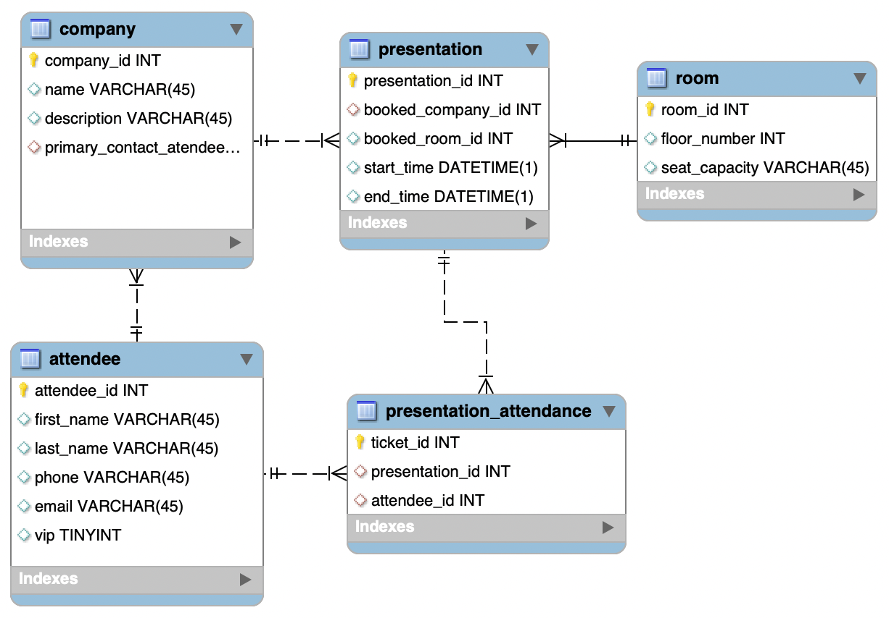

# Schema

Até o momento nós apenas fizemos consultas em bancos de dados prontos. A partir de agora nós precisamos entender como criar nossos próprios bancos dados, definir a estrutura das tabelas (colunas, tipos de dados e restrições) e definir como uma tabela se conecta com outra estabelecendo relações. Toda essa estrutura de um banco de dados se chama schema e utilizaremos o MySQL Workbench como ferramenta para prototipar nosso banco.

    

