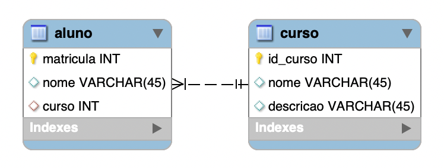

# One to Many (Um para Muitos)

  Na relação one to many, um registro de uma tabela pode estar associado a múltiplos registros de outra tabela, mas cada registro da segunda tabela está ligado a apenas um registro da primeira.

No exemplo abaixo vemos a relação de alunos com o curso de uma escola. Cada aluno só pode estar matriculado em um curso por vez. Porém, um mesmo curso terá diversos alunos.

