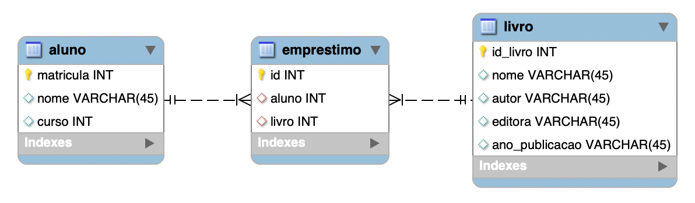

# Many to Many (Muitos para Muitos)

  Na relação many to many, um registro de uma tabela A pode estar associado a múltiplos registros de outra tabela B, assim como B pode estar associado a múltiplos registros da tabela A.

No exemplo abaixo vemos a relação de alunos com o empréstimos de livros de um biblioteca. Um aluno pode pegar emprestado diversos livros. Assim como um único livro pode ser emprestado para diversos alunos, desde que em épocas diferentes. A tabela empréstimo é uma tabela auxiliar que registra essas relações 

